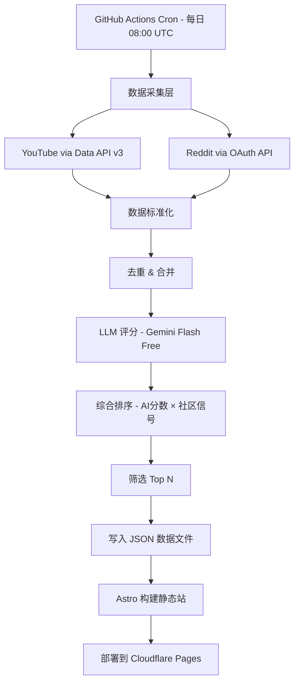

# feat: AI 每日动态聚合工作流（零成本版）

## Summary

构建一个全自动、零成本的每日 AI 工具动态聚合管道：从 YouTube 和 Reddit 采集内容，通过 Gemini Flash 免费版评分 + 社区互动信号双重筛选，输出到一个可浏览的静态 Dashboard 网页，部署在云端（GitHub Actions + Cloudflare Pages）。全部使用免费 API 和服务，月运行成本 $0。

---

## Problem Frame

AI 工具生态日新月异，每天有大量新工具发布、使用教程、最佳实践分散在各平台。手动追踪效率极低，且容易遗漏高质量内容。需要一个自动化管道：采集 → 评分筛选 → 结构化展示，确保每天能快速获取最有价值的 AI 工具进展，且每条内容都有明确的原始来源链接。

**为什么砍掉 X/Twitter：** Reddit（尤其 r/LocalLLaMA、r/artificial）是 AI 工具信息密度最高的平台，绝大多数 Twitter 首发内容 12 小时内会出现在 Reddit。YouTube 覆盖教程和深度测评。两者组合已能覆盖 80%+ 高价值信息，且完全免费。

---

## Requirements

- **R1.** 每日自动从 YouTube、Reddit 两个平台采集 AI 工具相关内容
- **R2.** 使用 LLM（Gemini Flash 免费版）对内容进行相关性/质量/新颖性评分
- **R3.** 结合平台互动指标（views、upvotes）进行综合排序筛选
- **R4.** 每条输出内容必须包含原始来源 URL、作者、发布时间
- **R5.** 输出为静态网页 Dashboard，支持按日期/平台/类别浏览
- **R6.** 全流程云端自动化运行（GitHub Actions cron），无需人工干预
- **R7.** 月运行成本 $0（仅使用免费服务和 API）

---

## Key Technical Decisions

**KTD1: 数据源选择 YouTube + Reddit（砍掉 X/Twitter）**
理由：X 官方 API 免费版无法读取推文，付费版 $200+/月。Reddit 的 AI 社区（r/LocalLLaMA 等）信息密度极高，大部分 Twitter 首发内容会在 12h 内被转发到 Reddit。YouTube 覆盖视频教程类内容。两者免费且覆盖率足够。

**KTD2: YouTube 使用官方 Data API v3（免费额度）**
理由：每天 10,000 单位配额完全足够（5-10 次搜索 = 500-1000 单位），成本为零。

**KTD3: Reddit 使用官方 API 免费版（OAuth）**
理由：100 请求/分钟的免费额度远超每日需求（5-6 个 subreddit 的 hot/new 帖子），零成本。

**KTD4: LLM 评分使用 Google Gemini 2.0 Flash 免费版**
理由：免费额度 15 RPM / 1500 请求/天，每日 ~200 条内容评分绰绰有余。支持 JSON 输出模式，评分 + 摘要生成质量满足需求。零成本。

**KTD5: Dashboard 使用 Astro 静态站点生成器 + Cloudflare Pages**
理由：Astro 零 JS 默认策略适合数据驱动的每日重建，Cloudflare Pages 免费且全球 CDN。GitHub Actions 触发构建，无需维护服务器。

**KTD6: 数据存储使用 JSON 文件（Git 仓库内）**
理由：每日数据量小（~30-50 条精选），JSON 文件足以支撑，无需数据库。Git 提供版本历史和备份。

**KTD7: GitHub Actions 使用 PAT 推送以触发下游工作流**
理由：默认 GITHUB_TOKEN 的 push 不会触发其他 workflow（GitHub 安全限制）。使用 PAT（存储为 Secret）确保 push 能触发 deploy.yml。

---

## High-Level Technical Design



**评分公式（详见 U5）：**
```
final_score = (relevance×0.4 + novelty×0.3 + actionability×0.3) × (1 + engagement_percentile × 0.5)
```

其中 `engagement_percentile` 为当日同平台采集内容中的互动数据百分位排名（0-1）。最终分数范围 1-15，阈值 3.0 以下排除。

---

## Scope Boundaries

### In Scope
- YouTube + Reddit 双平台数据采集
- Gemini Flash + 社区信号双重评分筛选
- 静态 Dashboard 网页展示
- GitHub Actions 自动化调度
- 按日期/平台/类别的基础浏览功能

### Deferred to Follow-Up Work
- X/Twitter 数据源（等免费方案成熟或预算允许时加入）
- 用户账号系统 / 个性化推荐
- 邮件/飞书/Slack 推送通知
- 全文搜索功能
- 更多数据源（Hacker News、Papers with Code、GitHub Trending）
- 移动端优化
- RSS 输出
- 历史数据归档机制

---

## Implementation Units

### U1. 项目脚手架 & 基础配置

**Goal:** 建立项目结构、依赖管理、环境变量配置和 GitHub Actions 基础工作流。

**Requirements:** R6, R7

**Dependencies:** 无

**Files:**
- `package.json`
- `tsconfig.json`
- `.env.example`
- `.github/workflows/daily-digest.yml`（骨架，U7 完善）
- `.gitignore`
- `src/config.ts`
- `src/types.ts`

**Approach:**
- TypeScript + Bun 运行时（轻量、快速）
- 环境变量管理：YOUTUBE_API_KEY、REDDIT_CLIENT_ID、REDDIT_CLIENT_SECRET、GEMINI_API_KEY
- GitHub Actions cron: `0 8 * * *`（UTC 08:00 = 北京时间 16:00）
- 配置文件定义：subreddit 列表、YouTube 搜索关键词、评分阈值、Top N 数量
- `ContentItem` 统一接口定义（title, url, author, platform, publishedAt, engagement, rawContent）

**Patterns to follow:** 标准布局，src/ 下按功能模块划分（collectors/, scoring/, output/）

**Test expectation:** none -- 纯脚手架，无业务逻辑

---

### U2. 数据采集模块 - YouTube

**Goal:** 通过 YouTube Data API v3 搜索近 24 小时发布的 AI 工具相关视频。

**Requirements:** R1, R4

**Dependencies:** U1

**Files:**
- `src/collectors/youtube.ts`
- `src/collectors/youtube.test.ts`

**Approach:**
- 使用 googleapis 包的 youtube.search.list 和 youtube.videos.list
- 搜索策略：5-8 个关键词轮询（"AI tools 2026", "new LLM release", "AI agents tutorial", "Claude/GPT new feature" 等），publishedAfter 限定为 24 小时内
- videos.list 补充详细统计数据（viewCount, likeCount）
- 过滤：时长 > 2 分钟（排除 Shorts），viewCount > 100（排除零流量）
- 输出标准化为 `ContentItem` 接口

**Test scenarios:**
- 正常搜索：mock API response，验证 ContentItem 输出格式正确
- 配额不足：mock 403 quota exceeded，验证返回空数组且记录警告日志
- 时长过滤：验证 < 2 分钟的视频被排除
- 视频元数据补充：验证 viewCount/likeCount 正确合并到搜索结果

---

### U3. 数据采集模块 - Reddit

**Goal:** 通过 Reddit API 获取指定 subreddit 的近 24 小时热门帖子。

**Requirements:** R1, R4

**Dependencies:** U1

**Files:**
- `src/collectors/reddit.ts`
- `src/collectors/reddit.test.ts`

**Approach:**
- Reddit OAuth2 应用授权（script app 类型，无需用户登录）
- 目标 subreddit: r/LocalLLaMA, r/artificial, r/MachineLearning, r/ChatGPT, r/singularity, r/StableDiffusion
- 获取 /hot 和 /new 端点，取 score > 10 且 24 小时内的帖子
- 标准化输出为 `ContentItem`：title, selftext (前 500 字), url, author, score, num_comments

**Test scenarios:**
- 正常获取：mock Reddit JSON response，验证标准化输出符合 ContentItem
- OAuth token 刷新：验证 access_token 过期后自动重新获取
- 时间过滤：验证 24 小时外的帖子被排除
- Score 阈值：验证 score < 10 的帖子被过滤

---

### U4. LLM 评分模块

**Goal:** 使用 Gemini Flash 免费版对采集的内容进行结构化评分，输出 relevance/novelty/actionability 三维分数和中文摘要。

**Requirements:** R2, R3

**Dependencies:** U2, U3

**Files:**
- `src/scoring/llm-scorer.ts`
- `src/scoring/llm-scorer.test.ts`
- `src/scoring/prompts.ts`

**Approach:**
- 使用 @google/generative-ai SDK，Gemini 2.0 Flash 模型
- 免费额度：15 RPM / 1500 请求/天（每日 ~200 条内容，远在限额内）
- 并发控制：最多 5 个并发请求（留 RPM 余量），请求间间隔 1s
- 评分 prompt 设计：JSON 输出模式（responseMimeType: "application/json"），三个维度各 1-10 分
  - relevance: 与 AI 工具/使用方法的相关程度
  - novelty: 信息的新颖性（是否为新发布/新方法）
  - actionability: 读者能否直接从中获得可操作的知识
- 同时生成 1-2 句中文摘要
- 降级策略：单条请求失败时重试 1 次，仍失败则给默认分数（5/5/5）并标记

**Test scenarios:**
- 正常评分：mock Gemini response，验证 JSON 解析和三维分数提取
- 结构化输出解析失败：验证 fallback 逻辑（重试一次，失败给默认分数）
- 限流处理：mock 429 response，验证退避重试逻辑
- 评分一致性：相同输入应产生相近分数（容差 ±2）

---

### U5. 综合排序 & 筛选模块

**Goal:** 结合 LLM 评分和平台互动数据，计算最终分数并筛选 Top N 条内容。

**Requirements:** R2, R3

**Dependencies:** U4

**Files:**
- `src/scoring/ranker.ts`
- `src/scoring/ranker.test.ts`

**Approach:**
- 社区信号标准化：将各平台的互动数据转换为 0-1 的百分位排名（参考群体为当日同平台的所有采集内容）
  - YouTube: viewCount + likeCount 加权
  - Reddit: score + num_comments 加权
- 综合公式：`final_score = (relevance×0.4 + novelty×0.3 + actionability×0.3) × (1 + engagement_percentile × 0.5)`
- 按 final_score 降序排列，取 Top 30（可配置）
- 去重：使用标题 normalized Levenshtein distance，相似度 > 0.8 的内容只保留最高分的一条

**Test scenarios:**
- 排序正确性：给定已知分数的内容列表，验证排序结果
- 去重逻辑：标题相似度 > 0.8 的内容只保留一条
- 边界情况：所有内容分数相同时的稳定排序
- 筛选阈值：final_score < 3.0 的内容被排除（即使在 Top N 内）

---

### U6. 静态 Dashboard 网站

**Goal:** 使用 Astro 构建每日更新的静态 Dashboard，展示精选内容。

**Requirements:** R4, R5

**Dependencies:** U5

**Files:**
- `site/astro.config.mjs`
- `site/package.json`
- `site/src/pages/index.astro`
- `site/src/pages/[date].astro`
- `site/src/components/ContentCard.astro`
- `site/src/components/FilterBar.astro`
- `site/src/layouts/Layout.astro`
- `site/src/styles/global.css`

**Approach:**
- Astro 静态站点，读取 `data/` 目录下的 JSON 文件生成页面
- 首页展示今日精选，历史页面按日期归档
- 每张内容卡片展示：标题、中文摘要、来源平台标签、评分、互动数据、原始链接按钮
- 客户端筛选（Astro islands）：按平台（YouTube/Reddit）和类别过滤
- 响应式设计，暗色主题为主
- 无需用户系统，纯静态内容展示

**Test scenarios:**
- 构建成功：给定 fixture JSON 数据，验证 Astro build 无错误
- 内容卡片渲染：验证所有必要字段（标题、来源 URL、平台、日期）都有展示
- 空数据处理：某一天无数据时显示友好的"暂无内容"提示
- 日期导航：验证日期路由 /2026-06-03 能正确加载对应数据

---

### U7. GitHub Actions 工作流 & 部署

**Goal:** 配置完整的 CI/CD 管道：定时触发采集 → 评分 → 构建 → 部署。

**Requirements:** R6, R7

**Dependencies:** U1, U6

**Files:**
- `.github/workflows/daily-digest.yml`（完善 U1 创建的骨架）
- `.github/workflows/deploy.yml`
- `src/main.ts`（管道入口）

**Approach:**
- daily-digest.yml: cron 触发 → 运行 main.ts（collect → score → rank → write JSON）→ 使用 PAT commit & push 到 main 分支
- deploy.yml: 由 push 事件触发（PAT push 能触发下游 workflow），构建 Astro 站点并部署到 Cloudflare Pages
- 执行序列：`daily-digest.yml` push 完成 → 触发 `deploy.yml` → Astro build → Cloudflare Pages 部署
- Secrets 管理：YOUTUBE_API_KEY, REDDIT_CLIENT_ID, REDDIT_CLIENT_SECRET, GEMINI_API_KEY, GH_PAT
- 失败通知：Actions 失败时通过 GitHub 自带的邮件通知
- main.ts 串联逻辑：任一平台采集失败不阻塞整体管道

**Test scenarios:**
- 管道串联：mock 所有外部调用，验证 main.ts 的完整执行流程
- 部分采集失败：YouTube 采集失败时，Reddit 数据仍正常处理并输出
- 数据写入：验证 JSON 文件正确写入 data/YYYY-MM-DD.json
- Git commit：验证自动提交消息格式正确（"chore: daily digest 2026-06-03"）

**Verification:** GitHub Actions 日志显示完整执行，Cloudflare Pages 部署成功，Dashboard 展示当日内容。

---

## Risks & Contingencies

**Gemini 免费额度变动风险：** Google 可能调整免费额度。备选方案：Groq 免费版（Llama 3，30 RPM）、Cloudflare Workers AI（10K neurons/day 免费）、或回退为纯规则评分（关键词 + 互动数据加权，不使用 LLM）。

**Reddit API 政策变动风险：** Reddit 曾在 2023 年大幅调整 API 政策。备选方案：通过 RSSHub 获取 RSS feed、或使用 Pushshift 数据存档。

**YouTube API 配额不足风险：** 若搜索关键词增多导致配额紧张。缓解措施：减少搜索频率到隔日一次、或只追踪固定频道列表（channels.list 成本更低）。

---

## Open Questions

- **Q1.** LLM 评分 prompt 的最终措辞需要迭代调优（初版上线后根据输出质量调整）
- **Q2.** 去重算法（标题相似度）的阈值需要实际数据验证
- **Q3.** Gemini Flash JSON 输出模式的稳定性需要测试确认（是否需要额外的 schema 约束）

---

## Sources & Research

- YouTube Data API v3: 10,000 units/day 免费额度（developers.google.com）
- Reddit API: 100 requests/minute 免费（OAuth 应用，reddit.com/prefs/apps）
- Google Gemini Flash 免费版: 15 RPM / 1500 RPD（ai.google.dev）
- Astro 静态站点框架: astro.build
- Cloudflare Pages: 免费静态托管 + CDN（500 builds/month）
- GitHub Actions: 免费额度 2000 分钟/月（公开仓库无限）
- 类似项目参考: RSSHub (github.com/DIYgod/RSSHub), ainews.dev

---

## Cost Estimate

| 项目 | 月费用 |
|------|--------|
| YouTube Data API v3 | $0（免费 10K units/day） |
| Reddit API | $0（免费 100 req/min） |
| Google Gemini Flash | $0（免费 1500 req/day） |
| Cloudflare Pages | $0（免费 500 builds/month） |
| GitHub Actions | $0（公开仓库无限分钟） |
| **总计** | **$0/月** |

*注：需要公开仓库以获得 GitHub Actions 无限免费分钟。若使用私有仓库，消耗免费额度 2000 分钟/月中的约 30 分钟/天 = 900 分钟/月，仍在免费范围内。*
