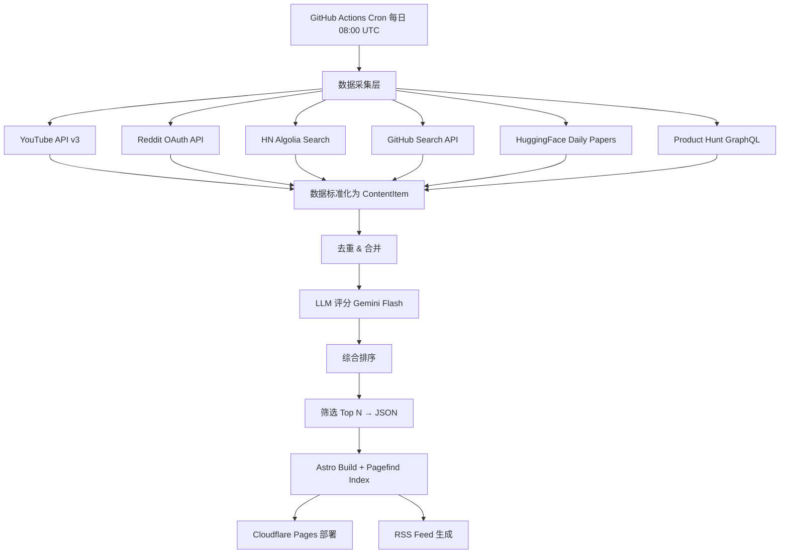

# feat: AI Daily Digest 完善升级

## Summary

在现有 AI Daily Digest 管道基础上进行三方面完善：(1) 新增 4 个免费数据源（Hacker News、GitHub Trending、Hugging Face Daily Papers、Product Hunt），扩大内容覆盖面；(2) Dashboard 体验升级——改进视觉设计、增加全文搜索（Pagefind）、RSS 订阅输出、强化移动端适配；(3) 确保 日期切换导航 和每日数据填充流程稳定运行。全部保持 $0/月成本约束。

---

## Problem Frame

当前管道仅覆盖 YouTube + Reddit 两个平台，AI 工具生态中的开源项目（GitHub）、学术论文（Hugging Face Papers）、产品发布（Product Hunt）、技术社区讨论（Hacker News）等高价值信息未被纳入。Dashboard 缺乏搜索能力，用户难以回溯历史内容；无 RSS 输出限制了订阅分发；移动端体验粗糙。

---

## Requirements

- **R1.** 新增 Hacker News 数据采集（AI 相关帖子，免费 API）
- **R2.** 新增 GitHub Trending 数据采集（AI/ML 仓库，使用 Search API + PAT）
- **R3.** 新增 Hugging Face Daily Papers 数据采集（替代已停服的 Papers with Code）
- **R4.** 新增 Product Hunt 数据采集（每日 AI 新产品，GraphQL API + Developer Token）
- **R5.** Dashboard 新增全文搜索功能（Pagefind 构建时索引）
- **R6.** Dashboard 新增 RSS feed 输出（@astrojs/rss）
- **R7.** Dashboard 视觉设计改进：新平台配色、卡片信息密度优化、更好的排版层次
- **R8.** Dashboard 移动端适配增强：触摸友好、堆叠布局、搜索可用
- **R9.** 日期导航和历史数据浏览正常工作（已有骨架，确保多平台数据稳定）
- **R10.** 保持 $0/月运行成本

---

## Key Technical Decisions

**KTD1: Papers with Code → Hugging Face Daily Papers**
Papers with Code API 已于 2025/2026 停服（302 重定向到 HF）。Hugging Face Daily Papers API（`/api/daily_papers`）提供每日 AI 论文精选，含 upvotes 信号，无需认证，是严格更好的替代。

**KTD2: GitHub Trending 使用 Search API（非第三方库）**
GitHub 从未发布官方 `/trending` API。第三方 `github-trending-api` 已于 2020 年停止维护。使用官方 `/search/repositories` 端点，认证后 30 req/min，配合 `topic:llm OR topic:agents` + `pushed:>{1d ago}` 查询，可稳定获取上升中的 AI 仓库。需要一个 PAT（已有用于 Actions push）。

**KTD3: Hacker News 使用 Algolia Search API 过滤 AI 话题**
Firebase 官方 API 只返回 ID 列表，需逐条 fetch 后客户端过滤，效率低。Algolia HN Search API 支持关键词 + 时间范围 + points 过滤，一次请求即可获取目标帖子。无需认证，无明确速率限制。

**KTD4: Product Hunt 使用 GraphQL API + Developer Token**
免费 Read-only 访问，Developer Token 无过期时间。注意：API 条款禁止商业用途，仅限个人/开发使用。每日一次查询远低于复杂度预算限制。

**KTD5: 搜索使用 Pagefind（构建时索引，零运行时成本）**
Pagefind 在 `astro build` 后扫描 HTML 输出生成静态索引，无需服务端。部署后搜索从 CDN 加载 chunk，支持中文分词。集成方式：在 `package.json` 构建脚本追加 `pagefind --site dist`。

**KTD6: RSS 使用 @astrojs/rss 从 JSON 数据生成**
不依赖 Content Collections，直接从 `data/*.json` 构建 RSS items。已有 `site` 配置（`https://ai-daily-digest.pages.dev`），满足 @astrojs/rss 要求。

---

## High-Level Technical Design



**新平台 engagement 计算：**
```
HN:         points + descendants(comments) × 2
GitHub:     stars + forks × 3
HF Papers:  upvotes × 10
PH:         votesCount + commentsCount × 2
```

---

## Scope Boundaries

### In Scope
- 4 个新数据源的 collector 实现
- platform 类型扩展和评分模块适配
- Pagefind 搜索集成
- RSS feed 输出
- Dashboard 视觉优化和移动端适配
- FilterBar 支持 6 个平台
- GitHub Actions 新增环境变量

### Deferred to Follow-Up Work
- 用户账号系统 / 个性化推荐
- 邮件/飞书/Slack 推送通知
- 标签分类体系（tools/papers/tutorials）
- 亮色主题切换
- i18n 多语言支持
- 数据归档/清理机制

---

## Implementation Units

### U1. 扩展类型系统和配置

**Goal:** 将 platform 类型扩展为 6 平台，新增配置项和环境变量。

**Requirements:** R1-R4, R10

**Dependencies:** 无

**Files:**
- `src/types.ts`
- `src/config.ts`
- `.env.example`

**Approach:**
- `platform` union 扩展为 `"youtube" | "reddit" | "hackernews" | "github" | "huggingface" | "producthunt"`
- config 新增 4 个平台配置区块（API endpoints、关键词、阈值）
- 新增环境变量：`GITHUB_PAT`（已有可复用）、`PRODUCTHUNT_TOKEN`
- HN 和 HF 无需认证，不需要新 env var

**Test expectation:** none -- 纯类型和配置扩展

---

### U2. Hacker News Collector

**Goal:** 通过 Algolia HN Search API 采集近 24 小时 AI 相关高分帖子。

**Requirements:** R1

**Dependencies:** U1

**Files:**
- `src/collectors/hackernews.ts`
- `src/collectors/hackernews.test.ts`

**Approach:**
- 使用 `https://hn.algolia.com/api/v1/search_by_date` 
- 查询参数：`query=AI OR LLM OR GPT OR agent&tags=story&numericFilters=points>20,created_at_i>{24h_ago_unix}`
- 多关键词轮询：["AI tools", "LLM", "GPT", "Claude", "AI agent"]
- 结果去重（by objectID），标准化为 ContentItem
- engagement: `{ score: points, comments: num_comments }`
- ID 格式：`hn-{objectID}`

**Patterns to follow:** `src/collectors/reddit.ts` 的结构——单一导出函数 `collectHackerNews()`，内部去重，graceful failure

**Test scenarios:**
- 正常采集：mock Algolia response，验证 ContentItem 输出格式
- 时间过滤：验证 24h 外的帖子被排除
- Points 阈值：验证 points < 20 的帖子被过滤
- API 失败：mock 错误响应，返回空数组并记录警告
- 去重：同一帖子多关键词命中，只保留一条

---

### U3. GitHub Trending Collector

**Goal:** 通过 GitHub Search API 获取近期上升的 AI/ML 仓库。

**Requirements:** R2

**Dependencies:** U1

**Files:**
- `src/collectors/github.ts`
- `src/collectors/github.test.ts`

**Approach:**
- 使用 `https://api.github.com/search/repositories`
- 认证：PAT via `Authorization: Bearer` header（30 req/min）
- 查询策略：两轮搜索
  1. `q=topic:llm OR topic:ai-agents OR topic:machine-learning created:>{7d_ago}&sort=stars&per_page=30`
  2. `q=topic:llm OR topic:ai-tools pushed:>{1d_ago}&sort=stars&per_page=30`
- 取两轮合集去重，按 star 数排序取 top 50
- ContentItem 映射：title=full_name, rawContent=description, url=html_url, author=owner.login
- engagement: `{ likes: stargazers_count, score: forks_count }`
- ID 格式：`github-{full_name}`

**Test scenarios:**
- 正常搜索：mock search response，验证输出格式
- 认证失败 401：验证降级处理（非认证 10 req/min 模式或跳过）
- 限流 403：验证退避和返回空数组
- 合并去重：两轮搜索有重复仓库，验证去重
- 空结果：搜索无结果时返回空数组

---

### U4. Hugging Face Daily Papers Collector

**Goal:** 通过 HF Daily Papers API 获取今日精选 AI 论文。

**Requirements:** R3

**Dependencies:** U1

**Files:**
- `src/collectors/huggingface.ts`
- `src/collectors/huggingface.test.ts`

**Approach:**
- 使用 `https://huggingface.co/api/daily_papers` 获取今日论文列表
- 无需认证，无明确速率限制
- 每条论文包含：title, arXiv summary, upvotes, paper URL
- ContentItem 映射：title=paper.title, rawContent=paper.summary(截取 500 字), url=`https://huggingface.co/papers/{id}`
- engagement: `{ likes: upvotes }`
- ID 格式：`hf-{paper.id}`

**Test scenarios:**
- 正常获取：mock API response，验证标准化输出
- 空列表：某天无新论文时返回空数组
- 网络失败：返回空数组并记录警告
- 字段缺失：部分论文无 summary 时 rawContent 为空字符串

---

### U5. Product Hunt Collector

**Goal:** 通过 PH GraphQL API 获取每日 AI 新产品。

**Requirements:** R4

**Dependencies:** U1

**Files:**
- `src/collectors/producthunt.ts`
- `src/collectors/producthunt.test.ts`

**Approach:**
- GraphQL 端点：`https://api.producthunt.com/v2/api/graphql`
- 认证：Developer Token via `Authorization: Bearer`
- 查询：`posts(order: VOTES, postedAfter: "yesterday_ISO", topic: "artificial-intelligence") { name, tagline, url, votesCount, commentsCount, makers { name } }`
- 过滤：只取 topic 含 AI/ML 关键词的产品
- ContentItem 映射：title=name, rawContent=tagline, url=url, author=makers[0].name
- engagement: `{ likes: votesCount, comments: commentsCount }`
- ID 格式：`ph-{slug}`

**Test scenarios:**
- 正常查询：mock GraphQL response，验证 ContentItem 输出
- Token 无效 401：返回空数组并记录警告
- 空日期：某天无 AI 产品时返回空数组
- 复杂度超限 429：退避处理

---

### U6. 管道集成和评分适配

**Goal:** 将 4 个新 collector 集成到 main.ts，并在 ranker 中添加新平台的 engagement 计算。

**Requirements:** R1-R4, R9

**Dependencies:** U2, U3, U4, U5

**Files:**
- `src/main.ts`
- `src/scoring/ranker.ts`
- `src/scoring/ranker.test.ts`

**Approach:**
- main.ts 中新增 4 个 try/catch 采集调用块（与现有 YouTube/Reddit 模式一致）
- `getEngagementValue()` 新增 4 个 platform case：
  - `hackernews`: `score + comments * 2`（与 Reddit 类似）
  - `github`: `likes(stars) + score(forks) * 3`
  - `huggingface`: `likes(upvotes) * 10`（论文数据量小，放大信号）
  - `producthunt`: `likes(votesCount) + comments * 2`
- 评分仍使用同一个 Gemini prompt，无需修改 LLM scorer

**Test scenarios:**
- 集成测试：mock 所有 6 个 collector，验证管道完整执行
- 部分失败：3 个源失败时其余仍正常处理
- Engagement 计算：各平台的 engagement 值计算正确
- 跨平台百分位：6 个平台各自独立计算百分位排名

---

### U7. Dashboard 视觉升级和多平台支持

**Goal:** 新增 4 个平台的配色和标签，改进卡片信息密度，优化整体视觉层次。

**Requirements:** R7, R8, R9

**Dependencies:** U6

**Files:**
- `site/src/styles/global.css`
- `site/src/components/ContentCard.astro`
- `site/src/components/FilterBar.astro`
- `site/src/pages/index.astro`
- `site/src/pages/[date].astro`

**Approach:**
- 新增 CSS 变量：
  - `--hackernews: #ff6600; --hackernews-bg: rgba(255,102,0,0.08)`
  - `--github: #8b5cf6; --github-bg: rgba(139,92,246,0.08)`
  - `--huggingface: #ffcd00; --huggingface-bg: rgba(255,205,0,0.08)`
  - `--producthunt: #da552f; --producthunt-bg: rgba(218,85,47,0.08)`
- ContentCard Props 中 platform 类型扩展
- `formatEngagement()` 新增各平台的显示格式
- FilterBar platforms 扩展为 6 个
- 页面副标题更新："每日精选 AI 工具动态 · 自动聚合自 6 大平台"
- 移动端优化：FilterBar 横向滚动（overflow-x: auto），卡片 padding 压缩
- 日期导航样式微调：高亮当前日期

**Test scenarios:**
- 构建验证：给定包含 6 个平台数据的 fixture JSON，验证 Astro build 成功
- 新平台卡片：验证每个新平台的标签颜色和 engagement 文案正确显示
- 筛选功能：FilterBar 点击各平台能正确过滤卡片
- 移动端布局：640px 以下 FilterBar 可横向滚动，卡片完整展示

---

### U8. Pagefind 搜索集成

**Goal:** 集成 Pagefind 为 Dashboard 提供构建时全文搜索能力。

**Requirements:** R5, R8

**Dependencies:** U7

**Files:**
- `site/package.json`
- `site/src/components/SearchBar.astro`（新建）
- `site/src/layouts/Layout.astro`
- `site/src/styles/global.css`（Pagefind UI 样式覆盖）

**Approach:**
- 安装 `pagefind` 为 devDependency
- 构建脚本改为 `"build": "astro build && npx pagefind --site dist"`
- 新建 SearchBar 组件：加载 `/pagefind/pagefind-ui.js`，挂载到页面顶部
- Pagefind UI 样式覆盖：适配暗色主题（`--pagefind-ui-*` CSS 变量）
- Layout.astro 引入 SearchBar 组件
- 部署时 `dist/pagefind/` 目录随站点一起发布

**Test scenarios:**
- 构建产物验证：`dist/pagefind/` 目录存在且含索引文件
- 搜索功能：build 后在 dist 中能搜索到已有内容的标题和摘要
- 中文搜索：中文关键词能匹配中文摘要内容
- 空搜索结果：无匹配时显示"未找到相关内容"

---

### U9. RSS Feed 输出

**Goal:** 生成 RSS feed 让用户可通过 RSS 阅读器订阅每日精选。

**Requirements:** R6

**Dependencies:** U7

**Files:**
- `site/package.json`（添加 @astrojs/rss）
- `site/src/pages/rss.xml.ts`（新建）
- `site/src/layouts/Layout.astro`（添加 RSS 自动发现链接）

**Approach:**
- `npm install @astrojs/rss`
- `rss.xml.ts` 读取最近 7 天的 JSON 数据文件，构建 items 数组
- 每个 item：title, link(原始 url), pubDate, description(summary), customData(platform/score)
- Layout head 中添加 `<link rel="alternate" type="application/rss+xml" title="AI Daily Digest" href="/rss.xml" />`
- 确保所有 URL 为绝对路径（已有 `site` 配置满足需求）

**Test scenarios:**
- RSS 生成：给定 fixture 数据，验证 `dist/rss.xml` 文件存在且为合法 XML
- 内容完整：每个 item 含 title、link、pubDate、description
- 空数据：无数据时 RSS 仍为合法 XML（空 channel）
- 日期排序：items 按发布时间降序排列

---

### U10. GitHub Actions 工作流更新

**Goal:** 更新 CI/CD 配置，添加新平台所需环境变量，确保 Pagefind 构建步骤。

**Requirements:** R9, R10

**Dependencies:** U6, U8, U9

**Files:**
- `.github/workflows/daily-digest.yml`
- `.github/workflows/deploy.yml`

**Approach:**
- daily-digest.yml 新增 secrets：`PRODUCTHUNT_TOKEN`（GITHUB_PAT 复用已有）
- deploy.yml 构建步骤改为使用更新后的 build script（含 Pagefind）
- 确保 `npm ci` 安装 pagefind 和 @astrojs/rss 依赖
- Secrets 总清单：YOUTUBE_API_KEY, REDDIT_CLIENT_ID, REDDIT_CLIENT_SECRET, GEMINI_API_KEY, GH_PAT, PRODUCTHUNT_TOKEN

**Test scenarios:**
- Workflow 语法验证：`actionlint` 检查无错误
- 环境变量传递：所有必需 secrets 在 workflow env 中声明
- Pagefind 构建：deploy 步骤在 astro build 后执行 pagefind

---

## Risks & Contingencies

**Gemini 免费额度压力：** 6 个平台数据量增大（预计 300-500 条/天 vs 之前 ~200 条）。仍在 1500 RPD 限制内，但余量减少。缓解：提高 minScore/minPoints 阈值减少进入评分的数据量；或降低 topN 限制到 20。

**Product Hunt 商业用途限制：** API 条款明确禁止商业使用。当前为个人项目无风险；若未来商业化需联系 PH 或替换为 scraping。

**GitHub Search API 限流：** 认证后 30 req/min。每日仅 2-3 次请求，风险极低。若 PAT 失效，自动降级到 10 req/min 非认证模式。

**Hugging Face API 变动：** Daily Papers API 无正式文档版本号。缓解：备用 RSS feed `https://huggingface.co/papers/rss` 可作为降级方案。

---

## Open Questions

- **Q1.** Pagefind 对中文内容的分词质量需实测验证（可能需要设置 `<html lang="zh-CN">` 或额外配置）
- **Q2.** Product Hunt topic 过滤的精确 slug 需在实际 API 中测试确认（"artificial-intelligence" vs "ai"）
- **Q3.** GitHub Search 关键词组合的最优策略需根据实际结果迭代

---

## Sources & Research

- Hacker News Firebase API: github.com/HackerNews/API（无速率限制）
- HN Algolia Search: hn.algolia.com/api（关键词+时间+分数过滤）
- GitHub REST Search API: docs.github.com/en/rest/search/search（30 req/min 认证）
- Hugging Face Daily Papers: huggingface.co/api/daily_papers（替代 Papers with Code）
- Product Hunt API v2: api.producthunt.com/v2/docs（GraphQL, Developer Token）
- Pagefind: pagefind.app（构建时静态搜索索引）
- @astrojs/rss: docs.astro.build/en/recipes/rss/（数据驱动 RSS 生成）
